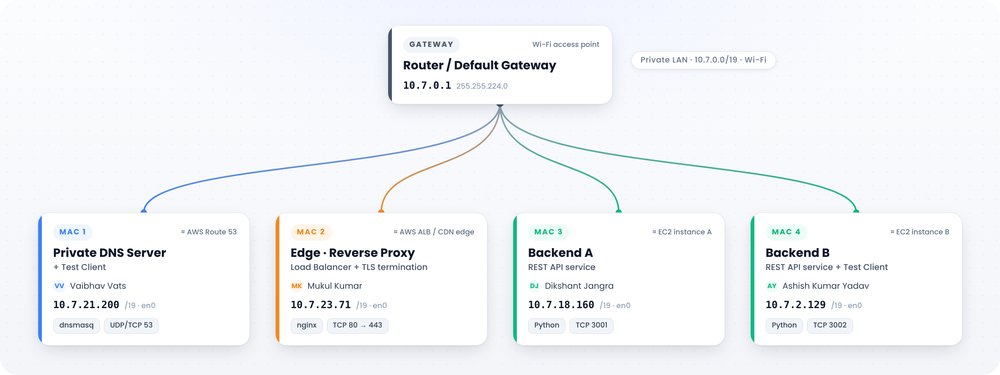
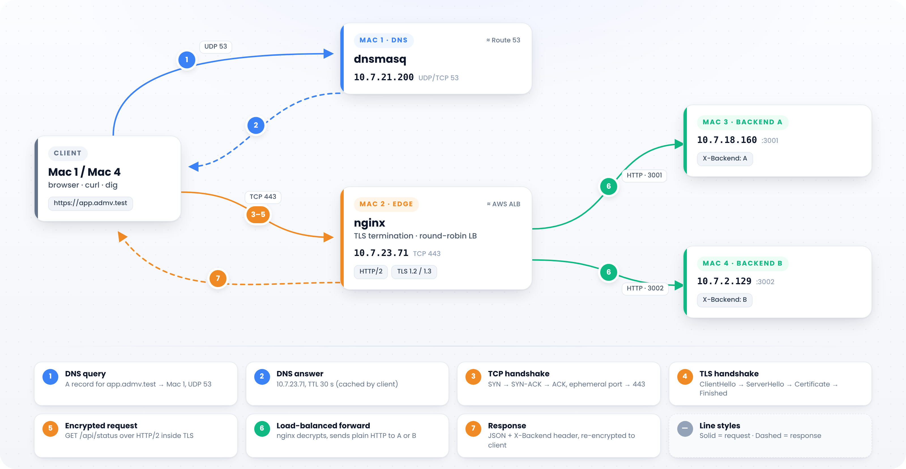

# Private Network Service Platform — Team ADMV
 
**Computer Networks Course Project** · Phase 1: Build & Observe
 
A private service environment built on four macOS laptops on a local network, with no cloud.
A client types `https://app.admv.test`, the name is resolved by **our own DNS server**, the request reaches
an **nginx edge over HTTPS**, and it is **load-balanced across two REST backends**. Every step is captured
and explained with `dig`, `curl` and Wireshark.
 
> The application stays simple; the network is the project.
 
---
 
## Team
 
| Member | Machine | Role | Responsible for |
|---|---|---|---|
| Vaibhav Vats | Mac 1 | Private DNS server + test client | dnsmasq, client resolver setup, Wireshark captures |
| Mukul Kumar | Mac 2 | Edge: reverse proxy + load balancer + TLS | nginx, certificates |
| Dikshant Jangra | Mac 3 | Backend A | REST service on port 3001 |
| Ashish Kumar Yadav | Mac 4 | Backend B + test client | REST service on port 3002 |
 
Every member can explain every component; roles only say who configured what.
 
---
 
## Architecture
 

 
### IP and service inventory
 
| Machine | Role | IPv4 | Prefix | Gateway | Interface | Services (port) | Cloud equivalent |
|---|---|---|---|---|---|---|---|
| Mac 1 | DNS + client | 10.7.21.200 | /19 | 10.7.0.1 | en0 | dnsmasq (UDP/TCP 53) | AWS Route 53 |
| Mac 2 | Edge | 10.7.23.71 | /19 | 10.7.0.1 | en0 | nginx (TCP 80 → 443) | AWS ALB / CDN edge |
| Mac 3 | Backend A | 10.7.18.160 | /19 | 10.7.0.1 | en0 | Python REST (TCP 3001) | EC2 instance A |
| Mac 4 | Backend B + client | 10.7.2.129 | /19 | 10.7.0.1 | en0 | Python REST (TCP 3002) | EC2 instance B |
 
MAC addresses and full interface details are in [`architecture/architecture.md`](architecture/architecture.md).
 
### Request flow
 

 
```
Client (Mac 1 / Mac 4)
   │ 1. DNS query  app.admv.test ?          UDP 53   ──►  Mac 1 (dnsmasq)
   │ ◄── answer: 10.7.23.71 (TTL 30 s)
   │ 2. TCP handshake  SYN / SYN-ACK / ACK   TCP 443  ──►  Mac 2 (nginx)
   │ 3. TLS handshake  (TLS terminated at the edge)
   │ 4. HTTPS GET /api/status  (HTTP/2, encrypted)
   ▼
Mac 2 (nginx, round-robin)
   ├── plain HTTP ──► Mac 3  Backend A :3001
   └── plain HTTP ──► Mac 4  Backend B :3002
```
 
### Protocol-to-layer mapping
 
| Step | Protocol | TCP/IP layer | OSI layer | Port |
|---|---|---|---|---|
| Name lookup | DNS over UDP | Application | 7 | 53 |
| Connection setup | TCP | Transport | 4 | ephemeral → 443 |
| Encryption | TLS 1.2 / 1.3 | Application / Transport boundary | 5–6 | 443 |
| Request / response | HTTP/2, HTTP/1.1 | Application | 7 | 443 (inside TLS) |
| Edge → backend | HTTP over TCP | Application | 7 | 3001 / 3002 |
| Addressing | IPv4 | Internet | 3 | none |
| Wi-Fi frames | IEEE 802.11 | Link | 2 | none |
 
---
 
## Repository structure
 
```
.
├── README.md
├── architecture/        topology, request-flow diagram, IP/service tables
├── config/              dnsmasq, nginx, TLS setup notes, public certificates
├── backend/             backend.py + run instructions
├── scripts/             preflight.sh (pre-demo health check)
└── evidence/phase1/     screenshots and packet captures, one folder per task
```
 
---
 
## Prerequisites
 
- 4 macOS laptops on the same private Wi-Fi / hotspot (no client isolation)
- [Homebrew](https://brew.sh) on every Mac
- Mac 1: `brew install dnsmasq` and `brew install --cask wireshark`
- Mac 2: `brew install nginx openssl@3`
- Mac 3, Mac 4: Python 3 (built into macOS via Command Line Tools)
- Fixed IPs (DHCP with manual address), firewall stealth mode off, iCloud Private Relay and browser secure DNS off
---
 
## Setup
 
### 1. DNS server (Mac 1)
 
```bash
cp config/dnsmasq.conf $(brew --prefix)/etc/dnsmasq.conf
$(brew --prefix)/sbin/dnsmasq --test
sudo brew services start dnsmasq
```
 
Records served: `app.admv.test` and `api.admv.test` → `10.7.23.71`, TTL 30 s.
All other names are forwarded to 8.8.8.8 / 1.1.1.1.
 
Point clients at Mac 1:
 
```bash
sudo networksetup -setdnsservers Wi-Fi 10.7.21.200     # Mac 2, Mac 3, Mac 4
sudo networksetup -setdnsservers Wi-Fi 127.0.0.1        # Mac 1 itself
sudo dscacheutil -flushcache; sudo killall -HUP mDNSResponder
```
 
### 2. Backends (Mac 3 and Mac 4)
 
```bash
# Mac 3
BACKEND_ID=A PORT=3001 python3 backend/backend.py
# Mac 4
BACKEND_ID=B PORT=3002 python3 backend/backend.py
```
 
| Endpoint | Response | Purpose |
|---|---|---|
| `GET /` | `{"message": "Backend A is running"}` | Liveness |
| `GET /api/status` | `{"backend": "A", "status": "ok"}`, `Cache-Control: no-store` | Load-balancing demo |
| `GET /api/info` | Static JSON, `Cache-Control: max-age=60`, `ETag` | Caching / 304 demo |
| all responses | `X-Backend: A` or `B` header | Shows which backend served the request |
 
Backends bind to `0.0.0.0` so the edge can reach them over the LAN.
 
### 3. TLS certificates (Mac 2)
 
A private CA (`ADMV Local CA`) signs a server certificate for `app.admv.test` and `api.admv.test`.
The full commands are in [`config/tls-setup.md`](config/tls-setup.md).
 
The CA certificate is trusted on every client:
 
```bash
sudo security add-trusted-cert -d -r trustRoot -k /Library/Keychains/System.keychain config/ca.crt
```
 
### 4. Edge / load balancer (Mac 2)
 
```bash
cp config/nginx-phase1.conf $(brew --prefix)/etc/nginx/servers/admv.conf
sudo nginx -t && sudo nginx
```
 
- Port 80 redirects to HTTPS on 443
- TLS terminated at nginx (TLS 1.2 and 1.3, HTTP/2 enabled)
- Round-robin upstream across `10.7.18.160:3001` and `10.7.2.129:3002`
- Passive health checks: `max_fails=1 fail_timeout=10s`, `proxy_next_upstream error timeout http_502 http_503`
- Evidence headers: `X-Edge`, `X-Upstream`
---
 
## Start-up order (demo day)
 
| # | Machine | Command |
|---|---|---|
| 1 | All | Join the team network; check `ipconfig getifaddr en0` |
| 2 | Mac 1 | `sudo brew services start dnsmasq` |
| 3 | Mac 3 | `BACKEND_ID=A PORT=3001 python3 backend/backend.py` |
| 4 | Mac 4 | `BACKEND_ID=B PORT=3002 python3 backend/backend.py` |
| 5 | Mac 2 | `sudo nginx -t && sudo nginx` |
| 6 | Mac 1 | `bash scripts/preflight.sh` |
 
---
 
## Verification
 
```bash
dig app.admv.test                              # SERVER: 10.7.21.200#53, answer 10.7.23.71
curl -v https://app.admv.test/api/status       # no certificate warnings, no -k
for i in {1..6}; do
  curl -s -D - -o /dev/null https://app.admv.test/api/status | grep -i x-backend
done                                            # A, B, A, B, A, B
curl -I https://app.admv.test/api/info         # Cache-Control + ETag
```
 
---
 
## Evidence index
 
All evidence is in [`evidence/phase1/`](evidence/phase1/). Each row maps to a step of the final demonstration sequence.
 
| Demo step | What it shows | Evidence |
|---|---|---|
| 1. Topology and IP inventory | Roles, IPs, services | [`architecture/`](architecture/) |
| 2. All machines on the LAN | Interface details, ping between every pair | [`A-lan/`](evidence/phase1/A-lan/) |
| 3. Private name resolution | `dig` from two clients, resolver settings, dnsmasq log | [`B-dns/`](evidence/phase1/B-dns/) |
| — Backends reachable from the edge | `X-Backend: A` and `B` by direct IP from Mac 2 | [`C-backends/`](evidence/phase1/C-backends/) |
| 4. HTTPS by name, no warnings | `curl -v`, browser padlock and certificate chain | [`D-loadbalancing/`](evidence/phase1/D-loadbalancing/), [`E-tls/`](evidence/phase1/E-tls/) |
| 5. Load balancing | A/B alternating; HTTP/2 vs HTTP/1.1 | [`D-loadbalancing/`](evidence/phase1/D-loadbalancing/) |
| 6. Packet evidence | DNS, TCP handshake, TLS handshake, certificate, flow graph | [`G-captures/`](evidence/phase1/G-captures/) |
| 7. HTTP caching | Headers, 200 vs 304, browser memory cache | [`F-caching/`](evidence/phase1/F-caching/) |
| 8. Backend failure | Service continues on Backend B | [`failures/3-one-backend-down.png`](evidence/phase1/failures/3-one-backend-down.png) |
 
### Packet captures
 
| File | Contents | Useful Wireshark filters |
|---|---|---|
| `G1-client-tls12.pcapng` | Full client request, TLS 1.2 (certificate visible) | `dns`, `tcp.stream eq 0`, `tls.handshake`, `tls.handshake.type == 11` |
| `G2-client-tls13.pcapng` | Same request, TLS 1.3 (certificate encrypted) | `tls.handshake` |
| `G3-edge-to-backend.pcap` | Mac 2 → backends, plain HTTP after TLS termination | `http` |
 
---
 
## Failure demonstrations
 
| # | Failure | Observation | What it shows |
|---|---|---|---|
| 1 | Wrong DNS server on a client | `dig` times out; `ping 10.7.23.71` works | DNS and IP connectivity are independent |
| 2 | DNS record points to a wrong IP | Resolution succeeds; connection refused | DNS is a directory, not a connection |
| 3 | Backend A stopped | All requests served by B, no errors | nginx fails over to the healthy upstream |
| 4 | Both backends stopped | DNS, TCP and TLS work; nginx returns 502 | Where the edge ends and the backend begins |
| 5 | Wrong destination port | Host pingable; TCP RST on port 4443 | IP finds the host, port finds the service |
 
Screenshots: [`evidence/phase1/failures/`](evidence/phase1/failures/)
 
---
 
## Security note
 
Private keys (`ca.key`, `server.key`) are **deliberately not in this repository** and are excluded by `.gitignore`.
Only public certificates (`ca.crt`, `server.crt`) are included. The CA exists only for this project and
should be removed from client keychains afterwards.
 
---
 
## Clean-up
 
```bash
sudo brew services stop dnsmasq                  # Mac 1
sudo nginx -s stop                               # Mac 2
sudo networksetup -setdnsservers Wi-Fi empty     # every client
# Keychain Access → System → delete "ADMV Local CA"
```
 
---
 
## Phase 2
 
Coming in Review 2: backup DNS resolver, TTL-controlled record changes, backend isolation with `pf`,
HA failover, DNS-based edge cutover, and the troubleshooting challenge.
 
